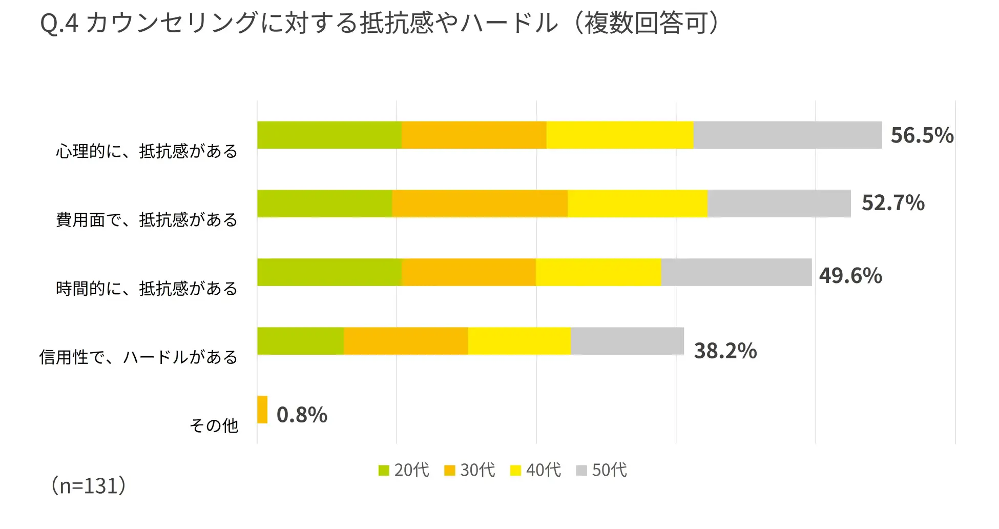

# アイカウンセラー
## チームバーガーキングβ

---

## 従業員の課題

<section class="two-col">

### ストレスチェックのグラフ傾向
- 全体的に仕事に関してのストレスが目立っている。

### 主なストレス要因
- 仕事とプライベートの境界の曖昧化
- コミュニケーションの希薄化

</section>

---

## 企業の課題と現状

<section class="two-col">

### 企業側の課題
- **早期把握の困難** 社員が多いと不調リスクを早期に把握できない
- **状態把握の困難** リモートだと従業員の状態が見えない
- **効果の測定が困難** 施策効果が測りにくい

### カウンセリング導入に関するアンケート結果　

</section>

---

## 匿名性とアクセスのしやすさ

### なぜ既存の相談窓口は使われない？
- 会社に知られることへの心理的抵抗
- 気づかない間にうつなどになるケースもある
- 電話とかで予約しないといけないため手間

### アプリによる解決
- **AI相手** だから本音で話しやすい
- 自分のスマホから **24時間** アクセス
- 会社には個人の特定データは渡らない

</section>

---

## 私たちの提案：AIメンタルヘルス・プラットフォーム

### サービス概要
- AIアバターとの対話で「こころの状態」を可視化
- 診断から医療機関の予約までをワンストップで提供
- ユーザーダッシュボードで状態を継続管理

### アプリの強み
- **即時フィードバック**: グラフによる数値化
- **医療連携**: アプリから専門医・心理士予約できる

</section>

---

## アプリの利用フロー

<section class="two-col">

Step 1. ログイン・AI対話
セキュアにログインし、AIとのチャット形式で手軽にストレスチェックを実施。

Step 2. 診断結果の可視化
診断後すぐにグラフや数値で結果を表示。「あなたのこころの状態」へのフィードバックを行う。

Step 3. 専門家への接続
リスクが高い場合、アプリ内から直接「精神科医」や「オンライン臨床心理士」を検索・予約。

Step 4. ダッシュボード管理
過去の履歴や予約状況をマイページで一元管理。自身の変化に気づきやすくする。

</section>

---

## 労務への通知方法（プライバシー保護）

- 企業側へは **「統計データ」のみ** をレポート
- **共有される情報：**
  - 部署ごとの高ストレス者の割合
  - 組織全体のモチベーション推移
- **共有されない情報：**
  - 個人の診断結果、相談内容
  - 誰がいつ病院を予約したか

---

# モックアップ

---

## 期待される効果

### 従業員側
- AI相手なので気を使わず相談できる
- 自分の状態を客観的数値で把握
- クリニック予約のハードルが下がる

### 企業側
- 潜在的なメンタル不調者をAIがスクリーニング
- 組織全体の健康状態をダッシュボードで把握
- 離職防止と生産性向上への対策が打てる

</section>

---

## まとめ

- **AI × 医療連携** で早期発見から治療までサポート
- 従業員には「安心」と「手軽さ」を
- 企業には「組織の健康状態」の可視化を
- 誰も置き去りにしないメンタルヘルスケアの実現

---

# ご清聴ありがとうございました